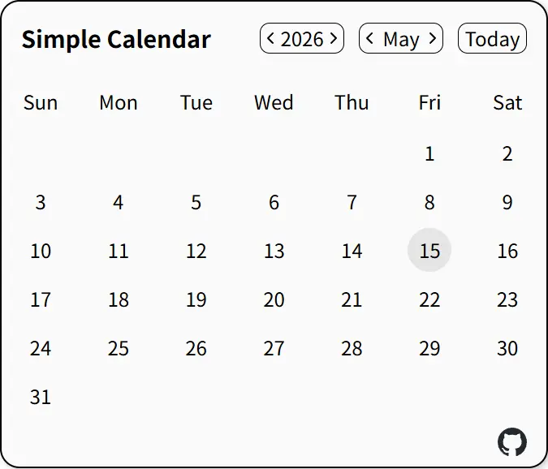

# Simple Calendar

A simple web app for browsing the calendar.

## Stack


## Live Demo

[Simple Calendar](https://calendar.matsubarasoda.com/)



## Features

- **Classic Layout:** Standard Sunday-to-Saturday calendar grid view.
- **Year Navigation:** Year selector supporting the year range 1970–2099 (inclusive), complete with previous and next step controls for quick adjustments.
- **Month Navigation:** Month selector from Jan through Dec, with previous/next controls; crossing January/December adjusts the year, clamped to the same year range as year navigation.
- **Jump to Today:** A Today button that resets the visible calendar to the current date (year, month, and day).
- **Clear Visual Feedback:** A clean, minimalist UI that clearly highlights the current date with a circular background.

## Roadmap

- Add internationalization (i18n) for the user interface.
- Display information about international days and weeks (presentation TBD).

## Quick Start

```bash
# clone repository and change directory
git clone https://github.com/MatsubaraSoda/simple-calendar.git
cd simple-calendar

# install dependencies
npm install

# start development server
npm run dev
```

## Project Structure

```
src/
├── App.vue
├── components/
│   ├── MonthSelect.vue
│   └── YearSelect.vue
├── global.css
├── main.ts
└── utils/
    └── dateTools.ts
```
